# 📖 Worked examples, end to end

Three formula pairs, each run through **every** stage of the pipeline, with the
intermediate object each stage produces. Nothing is hand-computed: every number
and every figure comes from one command per pair, and that command asserts its
own arithmetic against the shipped metric before it writes anything.

| | pair | what it shows | score |
|---|---|---|---|
| **[Part 1](#part-1--containment-two-variables-g-and-u)** | `G[0,1](x>0) && F[0,1](y<3)` vs `(x>0) U[0,1] (y<3)` | two variables, `G` and `U`, strict containment read off the canonical cells | **0.95** |
| **[Part 2](#part-2--bounded-atoms-a-disjunction-and-four-paths)** | `F[0,1]((x>0 && x<2) \|\| (x>4 && x<6))` vs `F[0,1](x>1 && x<5)` | a variable bounded on both sides, a disjunction becoming four paths, and `Point_sim_D`'s Jaccard branch actually firing | **0.4159** |
| **[Part 3](#part-3--two-equivalent-formulas-one-canonical-space)** | the L-shape, cut two ways | two *different* decompositions of one region collapsing to the *same* canonical object | **1.0** |

Read Part 1 first: it explains every stage. Parts 2 and 3 cover only what they
add.

-----

## Contents

- [Reading the interval figures](#reading-the-interval-figures)
- [Part 1 — containment, two variables, `G` and `U`](#part-1--containment-two-variables-g-and-u)
  - [Stage 0 — the string becomes a tree](#stage-0--the-string-becomes-a-tree)
  - [Stage 1 — the tree becomes boxes](#stage-1--the-tree-becomes-boxes)
  - [Stage 2 — boxes become the signal space](#stage-2--boxes-become-the-signal-space)
  - [Stage 3 — canonicalisation](#stage-3--canonicalisation)
  - [Stage 4 — `Point_sim_D`, one call per axis](#stage-4--point_sim_d-one-call-per-axis)
  - [Stage 5 — `Path_sim`](#stage-5--path_sim)
  - [Stage 6 — `G` in both directions](#stage-6--g-in-both-directions)
  - [Appendix to Part 1 — every `Point_sim_D` call](#appendix-to-part-1--every-point_sim_d-call)
- [Part 2 — bounded atoms, a disjunction, and four paths](#part-2--bounded-atoms-a-disjunction-and-four-paths)
  - [A bounded interval is a conjunction, not a chained comparison](#a-bounded-interval-is-a-conjunction-not-a-chained-comparison)
  - [A disjunction becomes separate *paths*](#a-disjunction-becomes-separate-paths)
  - [Canonicalisation: disjoint breakpoint sets](#canonicalisation-disjoint-breakpoint-sets)
  - [The Jaccard branch, in full](#the-jaccard-branch-in-full)
  - [Why D matters, concretely](#why-d-matters-concretely)
  - [The matrix](#the-matrix)
  - [Appendix to Part 2 — the fifteen distinct calls](#appendix-to-part-2--the-fifteen-distinct-calls)
- [Part 3 — two equivalent formulas, one canonical space](#part-3--two-equivalent-formulas-one-canonical-space)
  - [The same set, cut two ways](#the-same-set-cut-two-ways)
  - [Canonicalisation, one side at a time](#canonicalisation-one-side-at-a-time)
  - [The same canonical object](#the-same-canonical-object)
  - [The score](#the-score)
  - [Other rewrites that score exactly 1.0](#other-rewrites-that-score-exactly-10)
- [Notes](#notes)

-----

## Reading the interval figures

Every part uses the same conventions:

* a coloured bar is the interval a cell allows for one variable at one instant
* a **grey** bar is an unconstrained slot, `(-inf, inf)`
* a **blank** row means that cell does not reach that instant
* an **open circle** is an open endpoint, a filled one is closed
* everything is clamped to `[-D, D]`, so a bar reaching the panel edge with no
  endpoint marker is unbounded

-----

## Part 1 — containment, two variables, `G` and `U`

This part explains every stage; Parts 2 and 3 build on it.

```bash
python3 plot_pipeline.py 'G[0,1](x>0) && F[0,1](y<3)' '(x>0) U[0,1] (y<3)' \
        -o figures/example
```

The pair:

```
φ = G[0,1](x>0) && F[0,1](y<3)      "x is positive at both instants, and y drops below 3 at some instant"
θ = (x>0) U[0,1] (y<3)              "x stays positive until y drops below 3, within one step"
```

| | |
|---|---|
| variables × instants | `{x, y} × {0, 1}` → **4 axes** per cell |
| D (truncation window) | **4** = max\|con(φ) ∪ con(θ)\| + 1 = 3 + 1 |
| raw boxes | **2** vs **2** |
| fine arrangement cells | **5** vs **11** |
| canonical cells | **3** vs **5** |
| `Path_sim` matrix | 3 × 5 = 15 pairs → 120 `Point_sim_D` calls |
| G(φ,θ) / G(θ,φ) | **1.0** / **0.9** |
| **similarity** | **0.95** |

The interesting fact, established below: **φ ⊊ θ strictly**. Every signal
satisfying φ satisfies θ, but not conversely — and the metric's two directions
report exactly that, 1.0 one way and 0.9 the other.

-----

### Stage 0 — the string becomes a tree

`reference_semantics.parse()` tokenises, then builds the AST by recursive
descent over the README grammar.

```
tokens(φ) = ['G[0,1]', '(', 'x', '>', '0', ')', '&&', 'F[0,1]', '(', 'y', '<', '3', ')']
tokens(θ) = ['(', 'x', '>', '0', ')', 'U[0,1]', '(', 'y', '<', '3', ')']
```

The tree is in **negation normal form by construction**: `!` is applied at parse
time via `negate()`, and `A -> B` is rewritten to `!A || B` in
`_Parser.implication()`. Neither appears here, but that is why `evaluate()`
below has no negation case at all.

Round-tripping confirms the parse:

```
str(parse(φ)) = ((G[0,1](x>0)) && (F[0,1](y<3)))
str(parse(θ)) = ((x>0) U[0,1] (y<3))
```

**Horizon.** `φ.horizon() = max(1+0, 1+0) = 1` and `θ.horizon() = 1 + max(0,0) = 1`,
so the joint horizon is 1 and the ambient grid is `{0,1} × {x,y}`.

**Constants.** `con(φ) ∪ con(θ) = {0, 3}` as exact `Fraction`s, so `resolve_D`
derives **D = 4**. Anything at or below 3 is refused, not clamped
(`resolve_D`, [similarity/stl_similarity.py](./similarity/stl_similarity.py)).

-----

### Stage 1 — the tree becomes boxes

`evaluate(formula, 0)` returns a **list of boxes**; a box maps an axis
`(instant, variable)` to an `Interval`, and any axis it omits is unconstrained.
The figures below draw that recursion **unrolled over instants** — a temporal
node fans out one child per offset in its window, exactly as the code does — so
there is one node per recursive call rather than one per syntactic operator.

#### φ

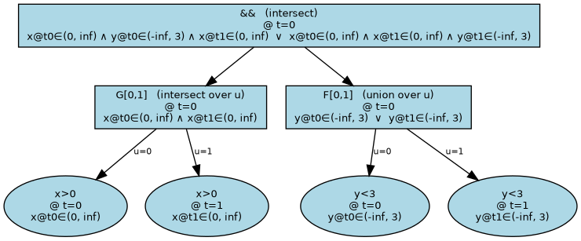

Read bottom-up:

| node | rule | result |
|---|---|---|
| `x>0 @ t=0`, `x>0 @ t=1` | atom → interval | `x@t0 ∈ (0,inf)`, `x@t1 ∈ (0,inf)` |
| `G[0,1] @ t=0` | **intersect** over `u ∈ {0,1}` | one box: `x@t0 ∈ (0,inf) ∧ x@t1 ∈ (0,inf)` |
| `y<3 @ t=0`, `y<3 @ t=1` | atom → interval | `y@t0 ∈ (-inf,3)`, `y@t1 ∈ (-inf,3)` |
| `F[0,1] @ t=0` | **union** over `u ∈ {0,1}` | two boxes |
| `&&` | per-axis **intersect** of the two box lists | **2 boxes** |

#### θ

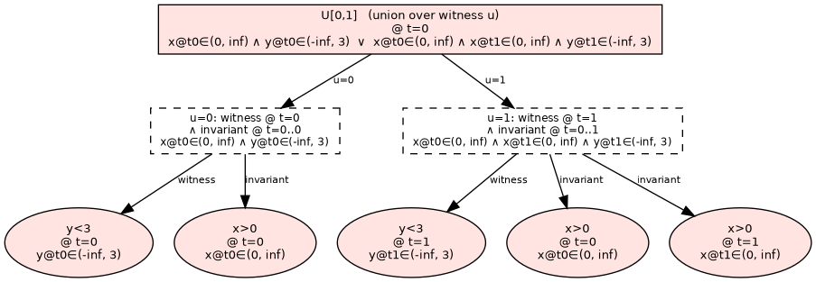

`Until` is a union over the witness instant `u`, and for each `u` the invariant
is required at every moment of the **closed** range `[t, t+u]`:

```
w, t ⊨ φ U[a,b] ψ   ⟺   ∃ u ∈ [a,b] : w, t+u ⊨ ψ  ∧  ∀ v ∈ [t, t+u] : w, v ⊨ φ
```

Note the closed `[t, t+u]`: **the invariant is required at the witness too.**
Textbook STL uses the half-open `[t, t+u)`. This is a deliberate choice, argued
in [PROOF.md](./PROOF.md) §2.4 and pinned by the test
`test_until_includes_its_witness`; it is also what stlsat's tableau computes, so
the differential cross-check needs no translation. The two dashed nodes in the
figure are the two disjuncts:

| `u` | witness | invariant | box |
|---|---|---|---|
| 0 | `y<3 @ t=0` | `x>0 @ t=0` | `x@t0 ∈ (0,inf) ∧ y@t0 ∈ (-inf,3)` |
| 1 | `y<3 @ t=1` | `x>0 @ t=0`, `x>0 @ t=1` | `x@t0 ∈ (0,inf) ∧ x@t1 ∈ (0,inf) ∧ y@t1 ∈ (-inf,3)` |

**This is already the whole difference between the two formulas.** The `u=0`
disjunct constrains *nothing* at `t=1`: θ discharges its obligation at instant 0
and stops caring. φ's `G[0,1]` requires `x>0` at `t=1` regardless. So θ admits
signals φ rejects, and never the reverse.

-----

### Stage 2 — boxes become the signal space

`signal_space()` lifts the box list to `list[Path]`, padding every path to the
full `{0,1} × {x,y}` grid with `(-inf, inf)`. Both formulas are evaluated over
the **joint** variable set and the **joint** horizon: `canonicalize()` requires
all paths to share one ambient axis set (hypothesis H1 of
[FORMAL_PROOFS.md](./FORMAL_PROOFS.md)) and raises on ragged input. Padding
changes neither region.

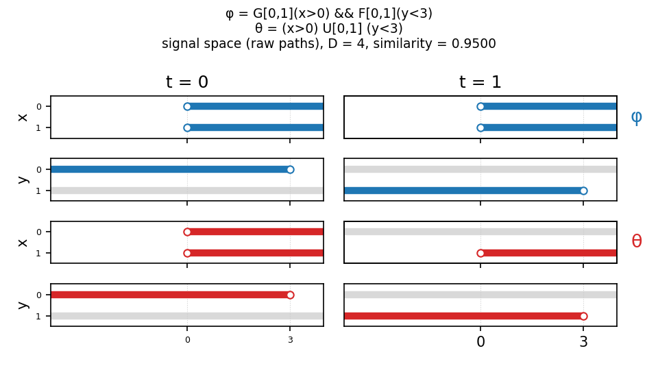

The same paths again, one colour each, with the axes a path leaves free spelled
out — the clearest form of the containment claim:

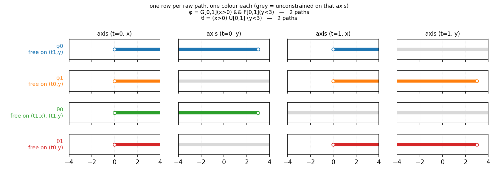

**θ0 is free on both of instant 1's axes.** It is the `u=0` disjunct: the until
is discharged at instant 0 and nothing at all is asserted afterwards. No path of
φ is free anywhere, because `G[0,1]` pins `x` at both instants. That single grey
row is why the backward direction cannot reach 1.

```
φ raw box 0:  t0: x(0,inf)  y(-inf,3)   |  t1: x(0,inf)  y(-inf,inf)
φ raw box 1:  t0: x(0,inf)  y(-inf,inf) |  t1: x(0,inf)  y(-inf,3)

θ raw box 0:  t0: x(0,inf)  y(-inf,3)   |  t1: x(-inf,inf)  y(-inf,inf)     <- the u=0 disjunct
θ raw box 1:  t0: x(0,inf)  y(-inf,inf) |  t1: x(0,inf)     y(-inf,3)
```

The grey bar at `(t=1, x)` in θ's first row is the visible form of the
containment: θ leaves that axis free, φ does not.

-----

### Stage 3 — canonicalisation

Two decompositions of the *same* region must produce the *same* object, or the
metric would score a formula differently depending on how it happened to be
split. `canonicalize()` ([similarity/canon.py](./similarity/canon.py)) achieves
that in three steps, **per formula independently** — it never looks at the
formula it is being compared against.

#### φ

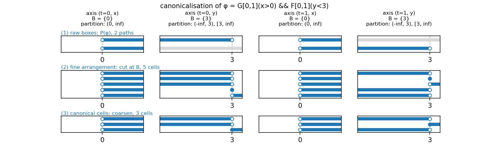

#### θ

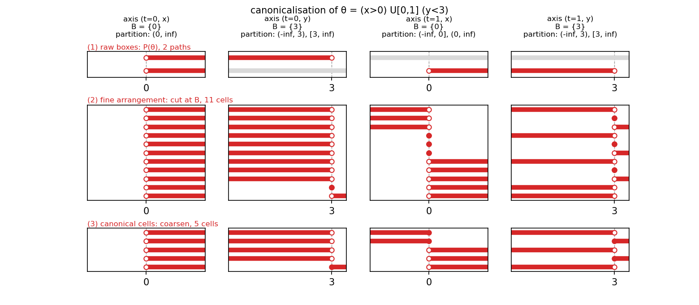

#### (a) breakpoints `B(v,t)`

Every finite endpoint *this formula's own* boxes use on that axis:

| axis | B(φ) | B(θ) |
|---|---|---|
| `(t=0, x)` | `{0}` | `{0}` |
| `(t=0, y)` | `{3}` | `{3}` |
| `(t=1, x)` | `{0}` | `{0}` |
| `(t=1, y)` | `{3}` | `{3}` |

The other formula's edges are deliberately **not** pooled in. An axis this
formula never bounds gets an empty set and is left whole — which is what stops
`F[3,4] x>0` from borrowing `F[0,2] x>0`'s breakpoint and manufacturing a
constraint out of genuine silence.

#### (b) fine arrangement

Each box is cut at its axis's breakpoints, and the **point slab** `[b,b]` is
emitted at every breakpoint the piece contains. Without the point slabs the
cells would *overlap* rather than partition: cutting `x>=1` and `x>1` at 1
produces two cells sharing the interior and each owning a different boundary
sliver. Every later step assumes a partition.

φ → **5 cells**, θ → **11 cells**. The point slabs are visible in the listing:

```
φ fine cells                                     θ fine cells (first six)
0: t0: x(0,inf) y(-inf,3) | t1: x(0,inf) y(-inf,3)   0: t0: x(0,inf) y(-inf,3) | t1: x(-inf,0) y(-inf,3)
1: t0: x(0,inf) y(-inf,3) | t1: x(0,inf) y[3,3]      1: t0: x(0,inf) y(-inf,3) | t1: x(-inf,0) y[3,3]
2: t0: x(0,inf) y(-inf,3) | t1: x(0,inf) y(3,inf)    2: t0: x(0,inf) y(-inf,3) | t1: x(-inf,0) y(3,inf)
3: t0: x(0,inf) y[3,3]    | t1: x(0,inf) y(-inf,3)   3: t0: x(0,inf) y(-inf,3) | t1: x[0,0]    y(-inf,3)
4: t0: x(0,inf) y(3,inf)  | t1: x(0,inf) y(-inf,3)   4: t0: x(0,inf) y(-inf,3) | t1: x[0,0]    y[3,3]
                                                     5: t0: x(0,inf) y(-inf,3) | t1: x[0,0]    y(3,inf)
```

#### (c) coarsening into a product grid

`_axis_partition` computes, per axis and once from the fine arrangement, the
maximal runs of adjacent atoms carrying the same cross-section. This is **not**
a greedy pairwise merge — greedy coalescing is not confluent, so on an L-shape
merging `x` first and `y` first give two different (both minimal) answers and
the "canonical" form would depend on axis order.
[Part 3](#part-3--two-equivalent-formulas-one-canonical-space) runs that
L-shape.

| axis | φ partition | θ partition |
|---|---|---|
| `(t=0, x)` | `(0, inf)` | `(0, inf)` |
| `(t=0, y)` | `(-inf, 3)`, `[3, inf)` | `(-inf, 3)`, `[3, inf)` |
| `(t=1, x)` | `(0, inf)` | **`(-inf, 0]`, `(0, inf)`** |
| `(t=1, y)` | `(-inf, 3)`, `[3, inf)` | `(-inf, 3)`, `[3, inf)` |

Two things worth noticing:

* **A partition covers the region, not all of ℝ.** φ's axis `(t=0, x)` is the
  single slab `(0, inf)`: φ requires `x>0` at `t=0` in every box, so the region
  never reaches `x ≤ 0` and there is nothing there to partition.
* **`(t=1, x)` is where the two formulas differ**, and it is the only axis whose
  partitions differ. θ's fine cells `x(-inf,0)` and `x[0,0]` carry the same
  cross-section, so they coalesce into `(-inf, 0]` — one slab, exactly the
  region φ forbids.

φ → **3 canonical cells**, θ → **5**:

```
φ0  t0: x(0,inf) y(-inf,3)  | t1: x(0,inf)   y(-inf,3)
φ1  t0: x(0,inf) y(-inf,3)  | t1: x(0,inf)   y[3,inf)
φ2  t0: x(0,inf) y[3,inf)   | t1: x(0,inf)   y(-inf,3)

θ0  t0: x(0,inf) y(-inf,3)  | t1: x(-inf,0]  y(-inf,3)     <- x ≤ 0 at t=1: φ has no such cell
θ1  t0: x(0,inf) y(-inf,3)  | t1: x(-inf,0]  y[3,inf)      <- likewise
θ2  t0: x(0,inf) y(-inf,3)  | t1: x(0,inf)   y(-inf,3)     == φ0
θ3  t0: x(0,inf) y(-inf,3)  | t1: x(0,inf)   y[3,inf)      == φ1
θ4  t0: x(0,inf) y[3,inf)   | t1: x(0,inf)   y(-inf,3)     == φ2
```

**θ's cell list literally contains φ's.** φ ⊊ θ, read off the canonical forms.

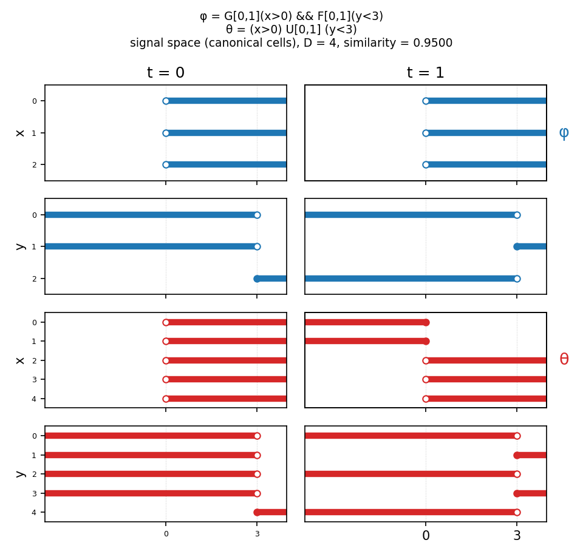

#### (d) trimming

`trim_trailing_undef()` drops a cell's trailing run of all-undefined instants,
so a discharged eventuality cannot spuriously match another formula's unrelated
silence. **Here it is a no-op**, and the reason is worth stating: coarsening
already replaced every `(-inf, inf)` slot with a real slab from the axis
partition, so no all-undefined instant survives to trim. Compare the grey bars
in the raw figure with their absence in the canonical one.

-----

### Stage 4 — `Point_sim_D`, one call per axis

`path_similarity` calls `point_sim_d` once per `(instant, variable)`, so **4
calls per cell pair** here. The function runs five steps in order
([similarity/stl_similarity.py](./similarity/stl_similarity.py)):

| # | step | fires here? |
|---|---|---|
| 1 | both slots undefined → `1.0`; exactly one → `0.0` | **no** — canonicalisation left no `(-inf,inf)` slot |
| 2 | truncate both to `[-D, D]`, via `intersect` so openness survives | always |
| 3 | identical after truncation → `1.0` | **yes**, and it is the common case here |
| 4 | `measure(meet) == 0` → `0.0`, without computing the join | **yes**, on axis `(t=1, x)` |
| 5 | Jaccard `\|meet\| / \|join\|`, exact `Fraction`s, float only at the boundary | **no** — see [Part 2](#part-2--bounded-atoms-a-disjunction-and-four-paths), where it is the whole story |

Worked on **φ0 vs θ0**:

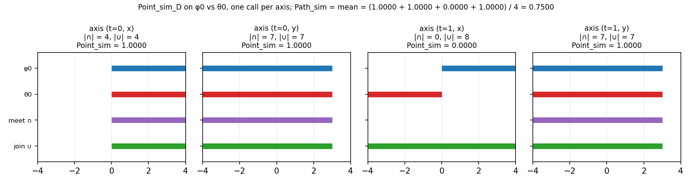

| axis | φ0 | θ0 | truncated | meet | join | `Point_sim` | which step |
|---|---|---|---|---|---|---|---|
| `(t=0, x)` | `(0,inf)` | `(0,inf)` | `(0,4]` vs `(0,4]` | 4 | 4 | **1.0** | step 3, identical |
| `(t=0, y)` | `(-inf,3)` | `(-inf,3)` | `[-4,3)` vs `[-4,3)` | 7 | 7 | **1.0** | step 3, identical |
| `(t=1, x)` | `(0,inf)` | `(-inf,0]` | `(0,4]` vs `[-4,0]` | 0 | 8 | **0.0** | step 4, disjoint |
| `(t=1, y)` | `(-inf,3)` | `(-inf,3)` | `[-4,3)` vs `[-4,3)` | 7 | 7 | **1.0** | step 3, identical |

Truncation is what keeps `measure` finite — an unbounded slab would otherwise
have infinite length and the ratio would be meaningless. Note the endpoint
handling: `(-inf,3)` clamps to `[-4,3)`, closed on the left because the window
`Interval(-D, D)` is closed, still open on the right because the constraint is.

-----

### Stage 5 — `Path_sim`

The mean over the joint axis set, `|T₁ ∪ T₂| × |vars| = 2 × 2 = 4`:

```
Path_sim(φ0, θ0) = (1.0 + 1.0 + 0.0 + 1.0) / 4 = 0.75
```

An instant present in only one of the two cells contributes **0**, not a
vacuous undefined/undefined match — it is not a shared instant where both are
silent, it is simply not comparable. Both cells span `{0,1}` here, so that
branch does not fire.

-----

### Stage 6 — `G` in both directions

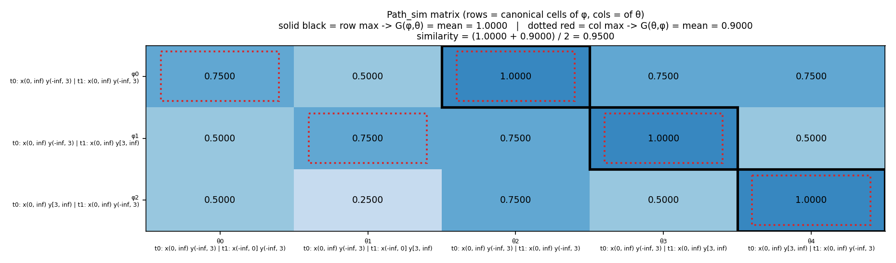

|  | θ0 | θ1 | θ2 | θ3 | θ4 | row max |
|---|---|---|---|---|---|---|
| **φ0** | 0.7500 | 0.5000 | **1.0000** | 0.7500 | 0.7500 | 1.0000 |
| **φ1** | 0.5000 | 0.7500 | 0.7500 | **1.0000** | 0.5000 | 1.0000 |
| **φ2** | 0.5000 | 0.2500 | 0.7500 | 0.5000 | **1.0000** | 1.0000 |
| **col max** | 0.7500 | 0.7500 | 1.0000 | 1.0000 | 1.0000 | |

```
G(φ,θ) = mean of row maxima = (1.0 + 1.0 + 1.0) / 3           = 1.0
G(θ,φ) = mean of col maxima = (0.75 + 0.75 + 1 + 1 + 1) / 5   = 0.9

similarity = (1.0 + 0.9) / 2 = 0.95
```

**Where the asymmetry comes from.** Every φ cell has an exact twin in θ
(φ0 = θ2, φ1 = θ3, φ2 = θ4), so every row maximum is 1 and the forward direction
is perfect. Backward, columns θ0 and θ1 — the two cells carrying
`x@t1 ∈ (-inf, 0]` — have no twin at all; their best match is 0.75, losing
exactly the one axis out of four where φ insists on `x > 0`. Two columns at 0.75
and three at 1.0 give 0.9.

This is the metric behaving as designed: a one-way containment is *not*
equivalence, the score is below 1, and the direction that is complete says so.

Empty regions short-circuit before any of this: both empty → 1 (two
unsatisfiable formulas are equivalent), exactly one empty → 0.

-----

### Appendix to Part 1 — every `Point_sim_D` call

`compute_similarity` makes **120** calls: 15 cell pairs × 4 axes × 2 directions.
`point_sim_d` is symmetric in its first two arguments, so the backward 60 repeat
the forward 60 with the arguments swapped. The forward 60, grouped four per
pair:

| cell pair | `(t=0, x)` | `(t=0, y)` | `(t=1, x)` | `(t=1, y)` | `Path_sim` |
|---|---|---|---|---|---|
| φ0 × θ0 | 1.0000 | 1.0000 | 0.0000 | 1.0000 | **0.7500** |
| φ0 × θ1 | 1.0000 | 1.0000 | 0.0000 | 0.0000 | **0.5000** |
| φ0 × θ2 | 1.0000 | 1.0000 | 1.0000 | 1.0000 | **1.0000** |
| φ0 × θ3 | 1.0000 | 1.0000 | 1.0000 | 0.0000 | **0.7500** |
| φ0 × θ4 | 1.0000 | 0.0000 | 1.0000 | 1.0000 | **0.7500** |
| φ1 × θ0 | 1.0000 | 1.0000 | 0.0000 | 0.0000 | **0.5000** |
| φ1 × θ1 | 1.0000 | 1.0000 | 0.0000 | 1.0000 | **0.7500** |
| φ1 × θ2 | 1.0000 | 1.0000 | 1.0000 | 0.0000 | **0.7500** |
| φ1 × θ3 | 1.0000 | 1.0000 | 1.0000 | 1.0000 | **1.0000** |
| φ1 × θ4 | 1.0000 | 0.0000 | 1.0000 | 0.0000 | **0.5000** |
| φ2 × θ0 | 1.0000 | 0.0000 | 0.0000 | 1.0000 | **0.5000** |
| φ2 × θ1 | 1.0000 | 0.0000 | 0.0000 | 0.0000 | **0.2500** |
| φ2 × θ2 | 1.0000 | 0.0000 | 1.0000 | 1.0000 | **0.7500** |
| φ2 × θ3 | 1.0000 | 0.0000 | 1.0000 | 0.0000 | **0.5000** |
| φ2 × θ4 | 1.0000 | 1.0000 | 1.0000 | 1.0000 | **1.0000** |

Column `(t=0, x)` is 1.0000 throughout: both formulas require `x>0` at instant 0
unconditionally, so that axis carries no information about their difference.

-----

## Part 2 — bounded atoms, a disjunction, and four paths

```bash
python3 plot_pipeline.py 'F[0,1]((x>0 && x<2) || (x>4 && x<6))' \
        'F[0,1](x>1 && x<5)' -o figures/example-bounded
```

```
φ = F[0,1]((x>0 && x<2) || (x>4 && x<6))    "at some instant, x is in (0,2) or in (4,6)"
θ = F[0,1](x>1 && x<5)                      "at some instant, x is in (1,5)"
```

Part 1 never showed a variable bounded on **both** sides, and every slab there
was a half-line — so `Point_sim_D` always exited at the identical-after-
truncation or disjoint early return and **every value in the whole walkthrough
was 0 or 1**. This pair is the opposite: the Jaccard ratio is the whole story.

| | Part 1 | Part 2 |
|---|---|---|
| variables × instants | `{x,y} × {0,1}` → 4 axes | `{x} × {0,1}` → **2 axes** |
| D | 4 | **7** = max\|con\| + 1 = 6 + 1 |
| raw paths | 2 vs 2 | **4 vs 2** |
| fine arrangement cells | 5 vs 11 | **32 vs 9** |
| canonical cells | 3 vs 5 | **16 vs 5** |
| `Path_sim` matrix | 3 × 5, 120 calls | **16 × 5, 320 calls** |
| `Point_sim_D` values seen | `{0, 1}` | **`{0, 1/9, 1/5, 1/3, 1/2, 7/8}`** |
| **similarity** | 0.95 | **0.4159375** |

### A bounded interval is a conjunction, not a chained comparison

`x>0 && x<2` is **two atoms on one variable**. `And` intersects per axis, so
the two half-lines become the single interval `(0,2)` on axis `(t, x)`.

The fragment has no chained-comparison syntax — an atom is `variable op
constant` and nothing else ([README](./README.md#-supported-fragment)):

```
parse("0<x<2")      ->  UnsupportedFormula: expected a variable, found '0'
parse("x<2<4")      ->  UnsupportedFormula: trailing input at '<'
parse("x>0 && x<2") ->  ((x>0) && (x<2))          <- this is how you write it
```

The two failures land in different places: `0<x<2` dies in `_Parser.primary()`
looking for a variable name, `x<2<4` parses a complete atom and then chokes on
the leftover tokens.

### A disjunction becomes separate *paths*

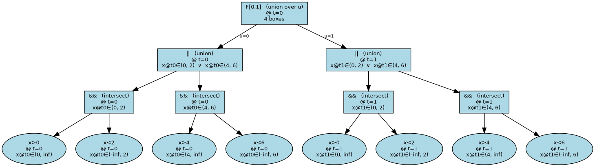

`evaluate()` returns a **list of boxes**, and `Or` simply concatenates the two
lists. It never produces one box holding a union. So on the definition route
**a slot always holds exactly one interval** — verified across
`(x<1)||(x>1)`, `x!=3` and this pair: maximum pieces per slot is 1 in every
case. `x!=3` is the sharpest illustration: it is *one atom* whose meaning is two
half-lines, and it still fans into separate paths rather than a two-piece slot.

That is what `similarity/canon.py`'s "exactly one interval per slot since a cell
is a box" means in practice, and it is where **multiple paths** come from:

```
φ raw paths (4 = 2 disjuncts × 2 witness instants):
   t0: (0, 2)       | t1: (-inf, inf)
   t0: (4, 6)       | t1: (-inf, inf)
   t0: (-inf, inf)  | t1: (0, 2)
   t0: (-inf, inf)  | t1: (4, 6)

θ raw paths (2 = 1 conjunct × 2 witness instants):
   t0: (1, 5)       | t1: (-inf, inf)
   t0: (-inf, inf)  | t1: (1, 5)
```

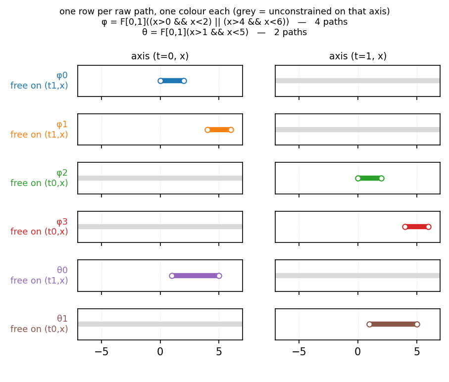

Each path fixes *where the eventuality was discharged* and leaves the other
instant free — read the right-hand note on each row. The four φ paths are the
four combinations of {which disjunct} × {which instant}, and each is a genuinely
different box, not a different piece of one box. With four paths on one side,
`one_way_similarity`'s per-path maximum finally has real alternatives to choose
between.

Stacked into the region view, the same four paths look like this:

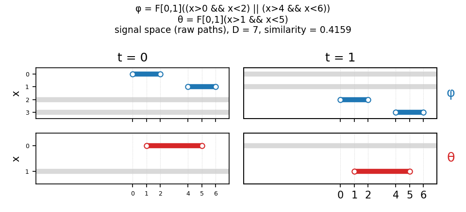

### Canonicalisation: disjoint breakpoint sets

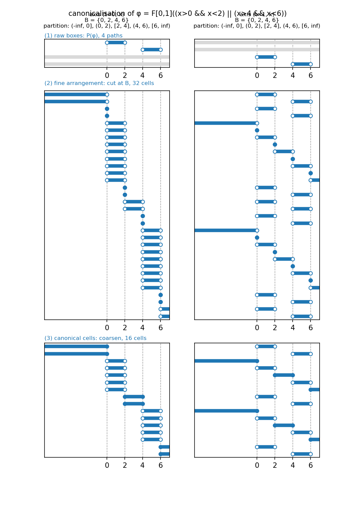

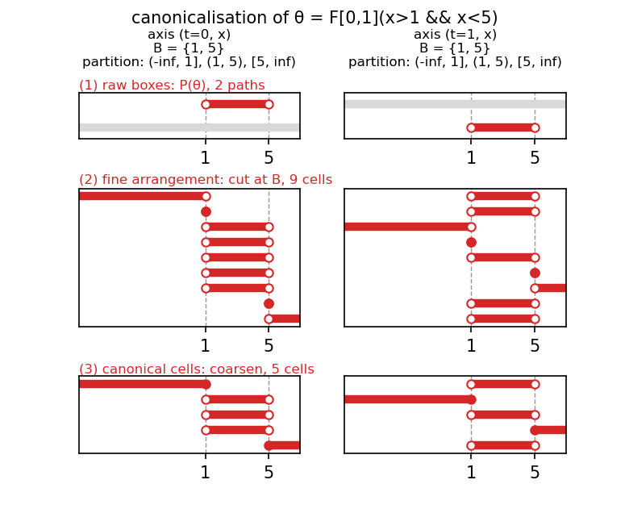

| | φ | θ |
|---|---|---|
| `B(t, x)`, both instants | `{0, 2, 4, 6}` | `{1, 5}` |
| axis partition | `(-inf,0]`, `(0,2)`, `[2,4]`, `(4,6)`, `[6,inf)` | `(-inf,1]`, `(1,5)`, `[5,inf)` |
| fine → canonical | 32 → **16** | 9 → **5** |

Breakpoints are unary — each formula cuts only at *its own* endpoints — and here
the two sets are **disjoint**. No slab of φ equals a slab of θ, so
`Point_sim_D`'s equality short-circuit never fires and every comparison goes all
the way to the ratio.

φ's four paths become sixteen cells because each path's *free* instant is
unconstrained, and the partition cuts the whole line there into five slabs. The
gap between `[2,4]` and the two disjuncts is the hole `(0,2) ∪ (4,6)` leaves
behind: `[2,4]` is in φ's partition of the axis, but no canonical cell has
`[2,4]` at **both** instants, because the eventuality has to be discharged
somewhere.

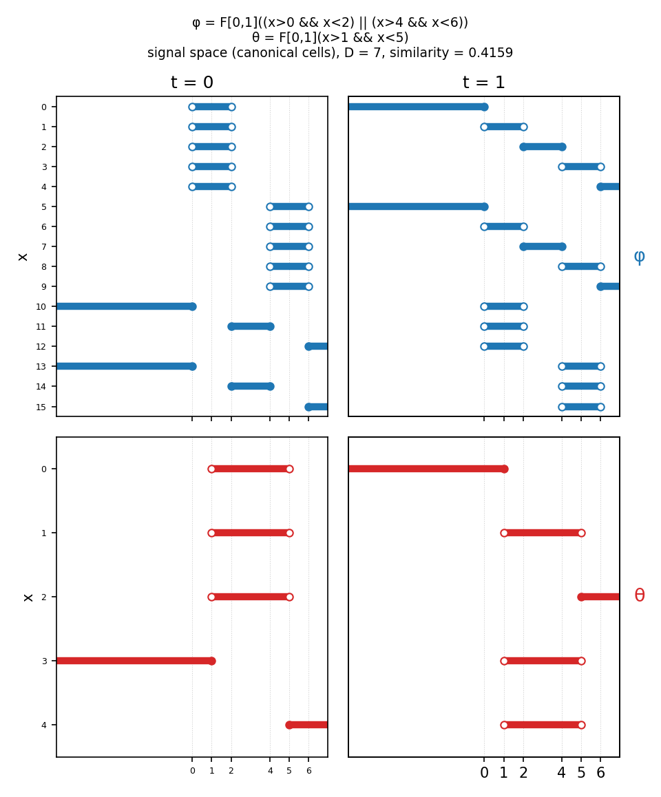

### The Jaccard branch, in full

`point_sim_d` depends only on the slab pair, never on which cell it came from.
5 φ-slabs × 3 θ-slabs = **15 distinct arguments** behind all 320 calls, and
6 distinct values. `|meet| / |join|` at D = 7:

| | `(-inf,1]` | `(1,5)` | `[5,inf)` |
|---|---|---|---|
| **`(-inf,0]`** | 7/8 = **0.8750** | 0 | 0 |
| **`(0,2)`** | 1/9 = **0.1111** | 1/5 = **0.2000** | 0 |
| **`[2,4]`** | 0 | 2/4 = **0.5000** | 0 |
| **`(4,6)`** | 0 | 1/5 = **0.2000** | 1/3 = **0.3333** |
| **`[6,inf)`** | 0 | 0 | 1/2 = **0.5000** |

Derivations for the non-zero entries — truncate to `[-7, 7]` first, then measure
exactly as `Fraction`s:

| slabs | truncated | meet | join | ratio |
|---|---|---|---|---|
| `(-inf,0]` vs `(-inf,1]` | `[-7,0]` vs `[-7,1]` | `[-7,0]`, len 7 | `[-7,1]`, len 8 | **7/8** |
| `(0,2)` vs `(-inf,1]` | `(0,2)` vs `[-7,1]` | `(0,1]`, len 1 | `[-7,2)`, len 9 | **1/9** |
| `(0,2)` vs `(1,5)` | unchanged | `(1,2)`, len 1 | `(0,5)`, len 5 | **1/5** |
| `[2,4]` vs `(1,5)` | unchanged | `[2,4]`, len 2 | `(1,5)`, len 4 | **2/4** |
| `(4,6)` vs `(1,5)` | unchanged | `(4,5)`, len 1 | `(1,6)`, len 5 | **1/5** |
| `(4,6)` vs `[5,inf)` | `(4,6)` vs `[5,7]` | `[5,6)`, len 1 | `(4,7]`, len 3 | **1/3** |
| `[6,inf)` vs `[5,inf)` | `[6,7]` vs `[5,7]` | len 1 | len 2 | **1/2** |

Every zero above is step 4 — the slabs are disjoint after truncation, so the
join is never even computed. Nine of the fifteen pairs exit there.

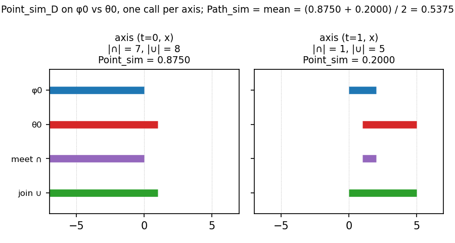

### Why D matters, concretely

Part 1 only pointed at the README for this. Here it is visible, because this
pair has both bounded and unbounded slabs:

| slab pair | D = 7 | D = 10 | D = 100 |
|---|---|---|---|
| `(-inf,0]` vs `(-inf,1]` | 0.8750 | 0.9091 | 0.9901 |
| `[6,inf)` vs `[5,inf)` | 0.5000 | 0.8000 | 0.9895 |
| `(0,2)` vs `(1,5)` | **0.2000** | **0.2000** | **0.2000** |
| whole-pair score | 0.4159 | 0.4465 | 0.4904 |

**Truncation only bites unbounded slabs.** Two half-lines differing by one unit
look ever more alike as the window grows (`D/(D+1)` and `(D-6)/(D-5)`, both → 1),
while the bounded pair is completely D-invariant: it lies inside every legal
window, so widening the window changes neither its meet nor its join.

Definition 2's `D > max|con(φ) ∪ con(θ)|` is a *correctness* floor — below it,
genuinely overlapping unbounded constraints truncate into disjoint ones — not a
claim that the score is D-independent. D = 7 is the tightest legal choice here,
and it is the one that lets the unbounded slabs contribute least.

### The matrix

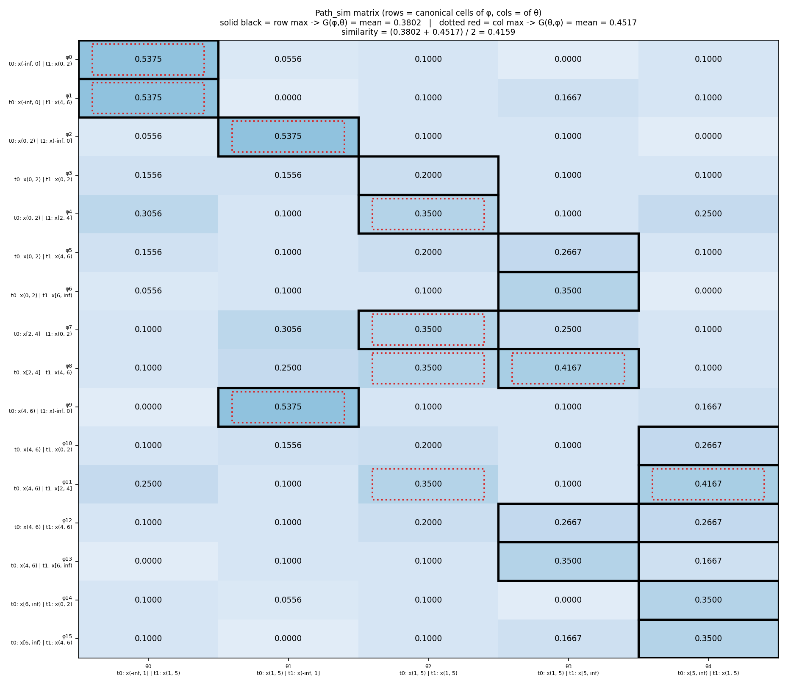

```
G(φ,θ) = mean of 16 row maxima = 0.380208
G(θ,φ) = mean of  5 col maxima = 0.451667
similarity = 0.4159375
```

The asymmetry runs the **opposite way** from Part 1. There, φ's cells were a
subset of θ's and the forward direction was perfect. Here neither region
contains the other, and θ scores better simply because it is *coarser*: its five
broad cells each find a tolerable partner among φ's sixteen, while many of φ's
finer cells — `φ6 = (0,2) | [6,inf)`, say — have nothing close on the other side.
Granularity, not containment.

### Appendix to Part 2 — the fifteen distinct calls

All 320 `Point_sim_D` calls are one of these. Each `Path_sim` entry in the
matrix is the mean of exactly two of them (one per instant), which is why the
whole 16 × 5 matrix takes only six distinct values on its diagonal structure.

| φ slab | θ slab | meet | join | `Point_sim_D` | branch |
|---|---|---|---|---|---|
| `(-inf,0]` | `(-inf,1]` | 7 | 8 | 0.8750 | Jaccard |
| `(-inf,0]` | `(1,5)` | 0 | — | 0.0000 | disjoint |
| `(-inf,0]` | `[5,inf)` | 0 | — | 0.0000 | disjoint |
| `(0,2)` | `(-inf,1]` | 1 | 9 | 0.1111 | Jaccard |
| `(0,2)` | `(1,5)` | 1 | 5 | 0.2000 | Jaccard |
| `(0,2)` | `[5,inf)` | 0 | — | 0.0000 | disjoint |
| `[2,4]` | `(-inf,1]` | 0 | — | 0.0000 | disjoint |
| `[2,4]` | `(1,5)` | 2 | 4 | 0.5000 | Jaccard |
| `[2,4]` | `[5,inf)` | 0 | — | 0.0000 | disjoint |
| `(4,6)` | `(-inf,1]` | 0 | — | 0.0000 | disjoint |
| `(4,6)` | `(1,5)` | 1 | 5 | 0.2000 | Jaccard |
| `(4,6)` | `[5,inf)` | 1 | 3 | 0.3333 | Jaccard |
| `[6,inf)` | `(-inf,1]` | 0 | — | 0.0000 | disjoint |
| `[6,inf)` | `(1,5)` | 0 | — | 0.0000 | disjoint |
| `[6,inf)` | `[5,inf)` | 1 | 2 | 0.5000 | Jaccard |

-----

## Part 3 — two equivalent formulas, one canonical space

```bash
python3 plot_pipeline.py \
  '((x>=0 && x<=2) && (y>=0 && y<=1)) || ((x>=0 && x<=1) && (y>=1 && y<=2))' \
  '((x>=0 && x<=1) && (y>=0 && y<=2)) || ((x>=1 && x<=2) && (y>=0 && y<=1))' \
        -o figures/example-lshape
```

The **L-shape** — the example `similarity/canon.py` was written for, and the
reason canonicalisation exists at all. One L-shaped region, described two ways:

```
φ = ((x>=0 && x<=2) && (y>=0 && y<=1)) || ((x>=0 && x<=1) && (y>=1 && y<=2))
θ = ((x>=0 && x<=1) && (y>=0 && y<=2)) || ((x>=1 && x<=2) && (y>=0 && y<=1))
```

No temporal operator, so the horizon is 0 and the grid is a single instant over
`{x, y}` — which makes this the one pair whose region can be drawn **as itself**,
in the plane, with nothing projected away.

### The same set, cut two ways

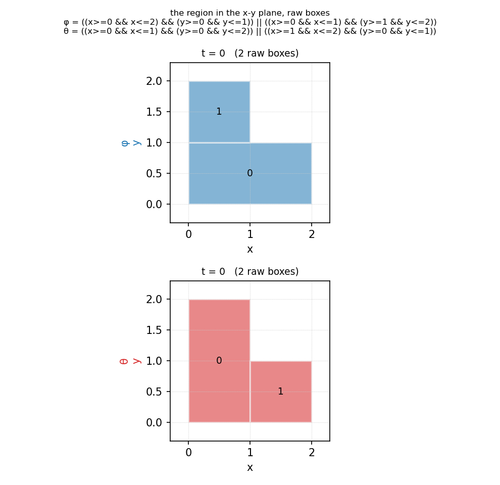

```
φ: x[0,2] y[0,1]   ∪   x[0,1] y[1,2]      <- split horizontally
θ: x[0,1] y[0,2]   ∪   x[1,2] y[0,1]      <- split vertically
```

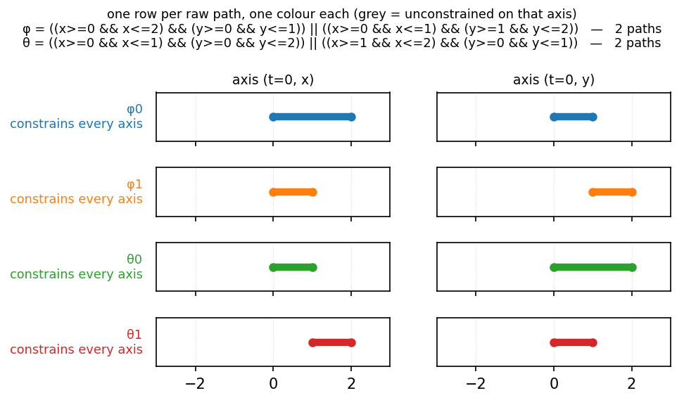

Every path here constrains every axis — there is no temporal operator to
discharge and therefore nothing to leave free. All four boxes are genuine
rectangles, and no two of them coincide.

The two decompositions **share no box**. Compared path-to-path, before
canonicalisation, they score **0.75** — each box of one overlaps but does not
equal a box of the other:

```python
from similarity.stl_similarity import build_volume_from_paths, compute_similarity
compute_similarity(build_volume_from_paths(φ, paths1, ["x", "y"]),
                   build_volume_from_paths(θ, paths2, ["x", "y"]), D=3)
# 0.75
```

That number is the problem canonicalisation solves. Two descriptions of the
*same set* must not score below 1, or the metric is measuring the author's
choice of decomposition rather than the formula's meaning.

### Canonicalisation, one side at a time

The same three sub-steps as Parts 1 and 2 — breakpoints, fine arrangement,
coarsening — run on each formula **independently**. `canonicalize()` is unary:
it never sees the formula on the other side. Reading the two figures side by
side is the point of this part, because the inputs differ and the outputs do
not.

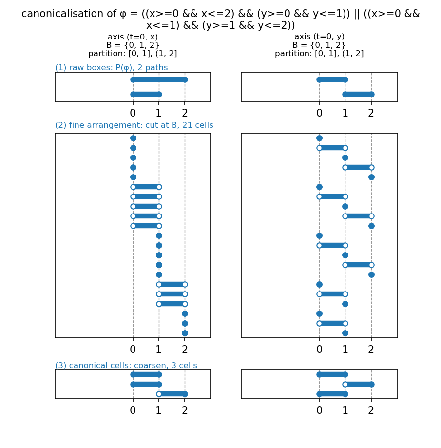

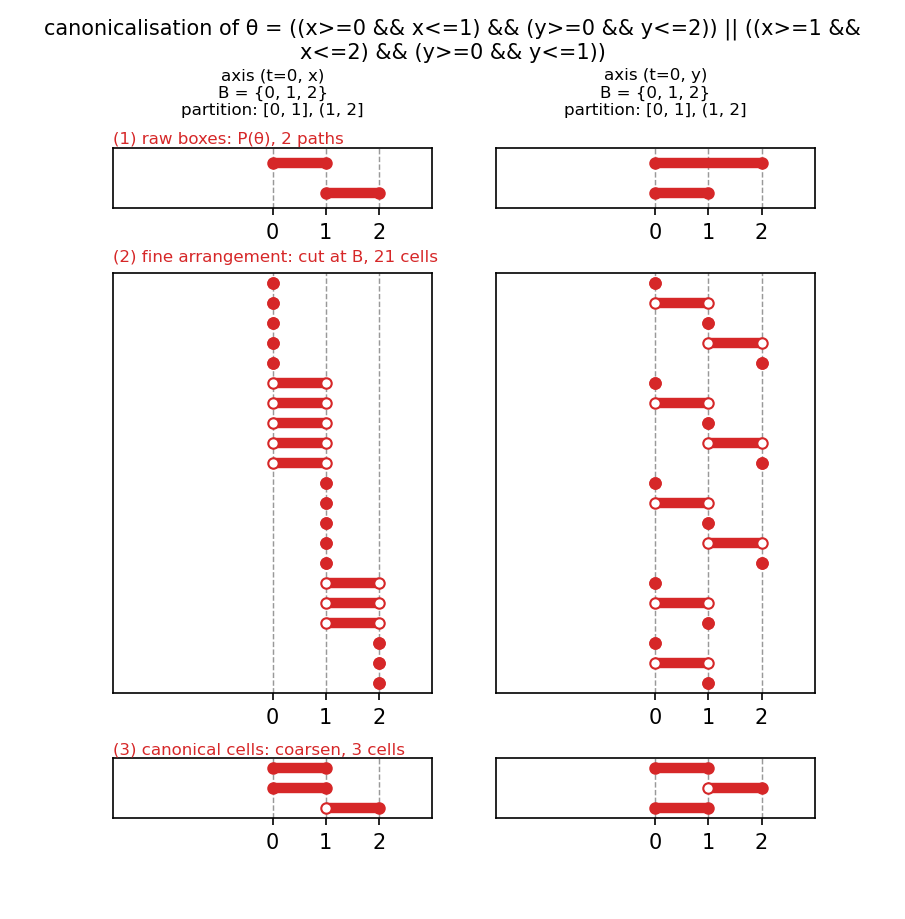

#### (a) breakpoints

| axis | B(φ) | B(θ) |
|---|---|---|
| `(t=0, x)` | `{0, 1, 2}` | `{0, 1, 2}` |
| `(t=0, y)` | `{0, 1, 2}` | `{0, 1, 2}` |

Identical — but *not* because the two formulas were compared. Each set is that
formula's own box endpoints, and both decompositions happen to put their edges
at the region's own corners. The coincidence is a property of the L, not of the
pairing. Contrast Part 2, where the two breakpoint sets are disjoint.

#### (b) fine arrangement — 21 cells on each side, reached differently

The cut is where the two sides visibly diverge. A closed endpoint sitting on a
breakpoint becomes its own point slab, so `[0,2]` cut at `{0,1,2}` yields five
atoms, `[0,1]` yields three:

| | φ | θ |
|---|---|---|
| box 0 | `x[0,2] y[0,1]` → **5 × 3 = 15** | `x[0,1] y[0,2]` → **3 × 5 = 15** |
| box 1 | `x[0,1] y[1,2]` → **3 × 3 = 9** | `x[1,2] y[0,1]` → **3 × 3 = 9** |
| shared between the boxes | 3 | 3 |
| distinct fine cells | 15 + 9 − 3 = **21** | 15 + 9 − 3 = **21** |

φ's boxes overlap along `y = 1` (three cells, `x ∈ {[0,0], (0,1), [1,1]}` at
`y = [1,1]`); θ's overlap along `x = 1` instead. Different seam, same count —
and the dedup by `cell_key` is what makes the arrangement a partition rather
than a double-counted union.

The point slabs are not decoration. Without `[1,1]`, φ's two boxes would produce
cells that overlap on the interior of the seam and each own a different boundary
sliver, and every later step assumes a partition.

#### (c) coarsening — where the difference disappears

| axis | φ partition | θ partition |
|---|---|---|
| `(t=0, x)` | `[0,1]`, `(1,2]` | `[0,1]`, `(1,2]` |
| `(t=0, y)` | `[0,1]`, `(1,2]` | `[0,1]`, `(1,2]` |

`_axis_partition` keeps maximal runs of adjacent atoms carrying the same
cross-section. On `x`, the atoms `[0,0]`, `(0,1)`, `[1,1]` all have the same
cross-section — the full `y ∈ [0,2]` extent of the L's tall arm — so they
coalesce into `[0,1]`; `(1,2)` and `[2,2]` coalesce into `(1,2]`. The seams φ
and θ each introduced were *not* bends in the region, so both are erased.

Note the half-open slab `(1,2]`: the point slab `[1,1]` coalesced **downward**
into `[0,1]`, so the cells partition the L rather than overlapping along the
line `x = 1`. That is exactly the boundary-sliver problem the point slabs exist
for.

### The same canonical object

```
φ: 2 raw boxes  ->  21 fine cells  ->  3 canonical cells
θ: 2 raw boxes  ->  21 fine cells  ->  3 canonical cells

    t0: x[0,1] y[0,1]
    t0: x[0,1] y(1,2]
    t0: x(1,2] y[0,1]           <- the same three, on both sides
```

The product grid `{[0,1], (1,2]} × {[0,1], (1,2]}` has four cells; three of them
lie in the region. The missing one is `(1,2] × (1,2]` — the notch that makes the
L an L.


Not merely the same *score*: the same **cells**, as literal set equality of
`cell_key`s. That is the strong form of the claim, and it is what
`tests/test_stl_similarity.py::test_worked_example_part3_matches_EXAMPLE_md`
asserts.

### The score

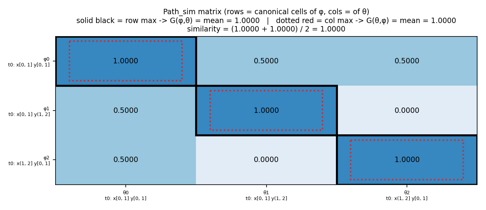

```
        θ0      θ1      θ2
φ0   1.0000  0.5000  0.5000
φ1   0.5000  1.0000  0.0000
φ2   0.5000  0.0000  1.0000

G(φ,θ) = G(θ,φ) = 1.0        similarity = 1.0
```

A perfect diagonal: every cell of φ *is* a cell of θ. `0.75` before, `1.0`
after — and the "after" is backed by literal set equality of cell keys, which is
a stronger statement than a score of 1.

### Other rewrites that score exactly 1.0

| φ | θ | why |
|---|---|---|
| `F[0,1](x>0)` | `(x>0) \|\| F[1,1](x>0)` | unrolling `F` |
| `G[0,1](x>0)` | `(x>0) && G[1,1](x>0)` | unrolling `G` |
| `!(G[0,1](x>0))` | `F[0,1](x<=0)` | temporal duality — `!` is pushed to the atoms at parse time |
| `(x>0) -> (y>0)` | `!(x>0) \|\| (y>0)` | `->` is rewritten, never implemented |
| `(x>0) U[0,0] (y>3)` | `(x>0) && (y>3)` | the closed-witness convention |
| `true` | `(x<=0) \|\| (x>=0)` | coarsening erases the constant entirely |

This list is illustrative, not exhaustive.
[verify_equivalence.py](./verify_equivalence.py) randomises exactly this
property — generate a formula, apply an equivalence-preserving rewrite, require
`G = 1` — over 120 trials by default.

-----

## Notes

* **On D.** Each part uses the tightest legal D for its own pair (4, 7 and 3).
  Definition 2 requires `D > max|con(φ) ∪ con(θ)|` as a *correctness*
  requirement — too small a D truncates two genuinely overlapping unbounded
  constraints into disjoint ones and silently changes the score — so a smaller D
  is refused rather than clamped. The score does still depend on D above that
  floor: [Part 2's table](#why-d-matters-concretely) shows exactly which slab
  pairs move and which do not, and the [README](./README.md#choosing-d) has the
  `x>2` / `x>5` numbers (0.25 at the derived D, 0.9694 at D = 100).
* **Reproducing this document.** Re-run the command at the top of each part. Each
  regenerates its own figure directory and prints the trace that part's tables
  were built from, and each asserts the matrix-derived score equals
  `calc_similarity_from_formulas` before writing, so a figure can never
  illustrate a number the metric does not produce. The headline numbers are
  additionally pinned by the `test_worked_example_*` tests in
  [tests/test_stl_similarity.py](./tests/test_stl_similarity.py).
* **The other route.** Everything above is the denotational path
  (`--via definition`), the one [PROOF.md](./PROOF.md) Theorem A is about.
  `--via tableau` derives the same region from stlsat's tableau instead and is
  cross-checked against this one rather than trusted.
