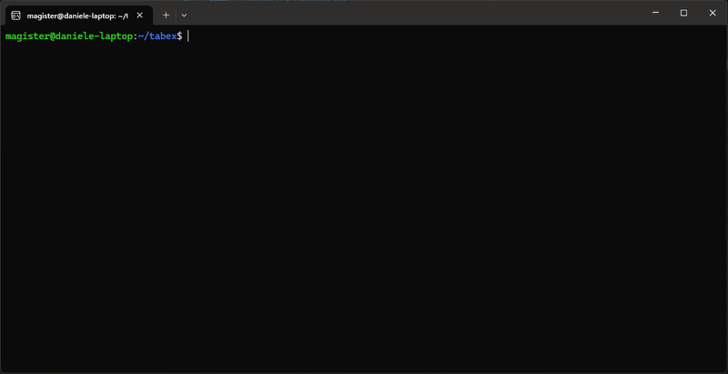

# Tabex: STL Similarity Metric Calculator

[](./LICENSE.md)
[](https://www.python.org/downloads/)

**Tabex** is the official repository for the Signal Temporal Logic (STL) similarity metric calculator. It utilizes a modified version of [stlsat](https://github.com/ZamponiMarco/stlsat.git) to extract satisfaction constraints, allowing users to calculate similarity between STL formulas based on those constraints.

---

## 📂 Source Code Structure

```bash
tabex_home/
├── benchmarks/                # Benchmarks folder
│   ├── Manual/                # Manually defined test cases
│   └── Random/                # Randomly generated test cases
├── dotparser/
│   └── input_creator.py       # Formula volume generation
├── figures/                   # Images used in README
├── similarity/
│   └── stl_similarity.py      # Similarity calculation script
├── run_similarity             # Runs the entire pipeline
├── m_stlsat/                  # Modified stlsat source code
├── LICENSE.md                 # Project license
└── README.md                  # Documentation
```

-----

## 🚀 Installation

### Requirements
  * **OS**: Tested on Ubuntu 22.04.5 LTS. 
  * **Python**: Tested with Python \> 3.10.
  * **Rust**: Required for stlsat ([rustup.rs](https://rustup.rs/)).
  * **Z3 Theorem Prover**: Z3 executable must be installed on your system.

> **Note**: It is not necessary to compile `stlsat` beforehand; it is run using `cargo run`, which builds the project automatically.

### Setup

Clone the repository:

```bash
git clone https://github.com/Salazar99/tabex.git
cd tabex
```

-----

## 🛠 Usage

### Define Environment Variable

Before running the tool, you must define the `TABEX_ROOT` variable:

```bash
# If cloned to your home folder:
export TABEX_ROOT=~/tabex
```

### 1\. One-Command Execution

Run the similarity calculation on two formulas directly:

```bash
python run_similarity "First_formula" "Second_formula" [--save-volumes]
```

  * **--save-volumes**: (Optional) Saves the formula volumes in a `.json` file.

### 2\. Manual Steps

You can run the pipeline stages independently:

#### **Volume Generation**

```bash
python dotparser/input_creator.py formula.stl output_file.json 
```

  * `formula.stl`: Contains the formula structure.
  * `output_file.json`: Will contain the generated formula's volume.

#### **Similarity Calculation**

```bash
python similarity/stl_similarity.py volume_1.json volume_2.json
```

### Usage Example

Below is a demonstration of the complete pipeline execution:


-----

## 📊 Benchmarks

Benchmarks are located in the `tabex/benchmarks` folder:

### Manual Benchmarks

Designed to show specific cases of interest.

```bash
cd benchmarks/Manual
bash benchmark_gen.sh
```

*This generates a `results.txt` containing the metric values for each benchmark.*

### Random Benchmarks

*Work in progress...*

-----

## 🤝 Developers & Credits

**Developers**

  * **Daniele Nicoletti**: daniele.nicoletti@univr.it | mr.nicoletti99@gmail.com

**Credits**

  * Original `stlsat` implementation by **@ZamponiMarco**.

-----

## 📄 License

This software is licensed under the **MIT License**.