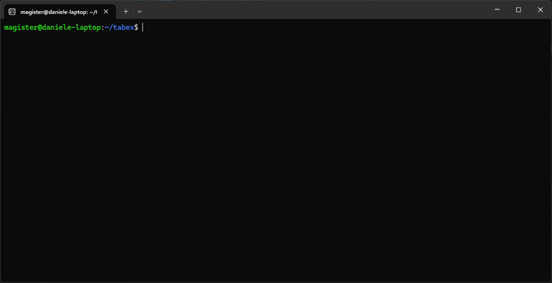

# Tabex: STL Similarity Metric Calculator

[](./LICENSE)
[](https://www.python.org/downloads/)

**Tabex** is the official repository for the Signal Temporal Logic (STL) similarity metric calculator. It utilizes a modified version of [stlsat](https://github.com/ZamponiMarco/stlsat.git) to extract satisfaction constraints, allowing users to calculate similarity between STL formulas based on those constraints.

---

## ⚡ Quick Start

```bash
git clone https://github.com/Salazar99/tabex.git
cd tabex
pip install pydot pytest
export TABEX_ROOT=$(pwd)

python run_similarity.py "F[0,2] x>0" "G[0,2] x>0"   # run the tool
pytest -q                                             # run the fast test suite
```

Rust + Z3 must also be installed before the first run (`run_similarity.py`
calls `stlsat` under the hood) — see [Installation](#-installation) below.
See [Testing](#-testing) for the full three-tier test suite (fast/integration/slow).

---

## 📂 Source Code Structure

```bash
tabex_home/
├── benchmarks/                # Benchmarks folder
│   ├── Manual/                # Manually defined test cases
│   └── Random/                # NOT YET IMPLEMENTED -- planned, doesn't exist on disk
├── figures/                   # TABEX.gif (README demo, pending re-recording against the aligned pipeline)
├── graph_examples/            # Sample stlsat tableau .dot files (also used as test fixtures)
├── scripts_old/               # Archived/legacy files, no longer part of the active pipeline
├── similarity/
│   ├── canon.py                # Canonical box decomposition of a formula's own signal space (unary, no comparison partner)
│   └── stl_similarity.py      # Similarity metric over parse_graph.py's signal space (preliminaries.tex)
├── tests/                     # Pytest suite
│   ├── conftest.py
│   ├── fixtures/              # Golden standardized-path outputs
│   ├── test_units.py
│   ├── test_canon.py
│   ├── test_dot_examples.py
│   ├── test_formula_to_signal_space.py
│   ├── test_semantics_examples.py
│   ├── test_stl_similarity.py
│   ├── test_reference_semantics.py  # the definition, and the tableau cross-checked against it
│   └── test_similarity_check.py
├── parse_graph.py             # Tableau -> signal space (standardization, Algorithm 1)
├── pytest.ini                 # Pytest markers/config for tests/
├── run_similarity.py           # Runs the entire similarity pipeline (CLI args)
├── similarity_check.py         # Interactive interface (prompts for formulas)
├── reference_semantics.py     # THE DEFINITION of the signal space (denotational, no tableau); the default path
├── verify_semantics.py        # Randomised: extracted region == the formula's real semantics
├── verify_equivalence.py      # Randomised: equivalent formulas score G = 1
├── verify_canon.py            # Randomised: canon.py is lossless and canonical
├── m_stlsat/                  # Vendored stlsat (fix-completeness) -- see m_stlsat/TABEX_FORK.md
│   └── TABEX_FORK.md          # The one file TABEX modifies, and why
├── LICENSE                    # Project license
└── README.md                  # Documentation
```

-----

## 🚀 Installation

### Requirements
  * **OS**: Tested on Ubuntu 22.04.5 LTS. 
  * **Python**: Tested with Python \> 3.10.
  * **Rust**: Required for stlsat ([rustup.rs](https://rustup.rs/)).
  * **Z3 Theorem Prover**: Z3 executable must be installed on your system.

> **Note**: It is not necessary to compile `stlsat` beforehand; it is run using `cargo run`, which builds the project automatically.

### Setup

Clone the repository:

```bash
git clone https://github.com/Salazar99/tabex.git
cd tabex
```

### Python Dependencies

```bash
pip install pydot pytest
```

  * **pydot**: required to parse stlsat's `.dot` tableau output (every code path).
  * **pytest**: only needed to run the test suite.

-----

## 🛠 Usage

### Define Environment Variable

Before running the tool, you must define the `TABEX_ROOT` variable:

```bash
# If cloned to your home folder:
export TABEX_ROOT=~/tabex
```

### 1\. One-Command Execution

Run the similarity calculation on two formulas directly:

```bash
python run_similarity.py "First_formula" "Second_formula" [--save-volumes]
```

  * **--save-volumes**: (Optional) Saves the formula volumes in a `.json` file.

Prefer typing formulas interactively instead of shell-quoting them as CLI
args? Run:

```bash
python similarity_check.py
```

It prompts for a first and second formula, prints the similarity score,
and loops so you can run more comparisons without restarting the
process. Type `quit` (or `exit`) at either prompt to leave.

### 2\. Manual Steps

You can run the pipeline stages independently: generate each formula's
signal space with `parse_graph.py`, then compare the two directly with
`similarity/stl_similarity.py`, which takes formula strings and calls
`stlsat` itself (no intermediate JSON file):

```bash
python similarity/stl_similarity.py "First_formula" "Second_formula" [--D VALUE] [--via WHICH]
```

  * **--D**: (Optional) Truncation window for `Point_sim_D`
    (Eq. `PointSimD`); auto-derived from the two formulas' constants if
    omitted.
  * **--via**: `definition` (default) computes each signal space by structural
    recursion on the formula — the route [FORMAL_PROOFS.md](./FORMAL_PROOFS.md)
    proves correct, and it needs no `stlsat`. `tableau` computes it from
    `stlsat` instead: faster on large formulas, and cross-checked against the
    definition rather than trusted.

<!--
> **Note**: The old JSON "volume" format tool (`input_creator.py`) has been
> archived to `scripts_old/` — it was superseded by `parse_graph.py`'s
> `Path`-based signal space and was never part of this similarity pipeline.
-->

### 3\. Signal Space Generation (`parse_graph.py`)

`parse_graph.py` turns a stlsat tableau into a "signal space": a set of
standardized, feasible `Path`s (Algorithm 1). It can either read an
existing tableau `.dot` file, or generate one on the fly by calling
`stlsat` for you.

#### **From an existing tableau**

```bash
python parse_graph.py graph_examples/graph_G.dot
```

#### **From an STL formula string**

```bash
python parse_graph.py --formula "G[0,2] x > 0"
```

This writes the formula to a temp `.stl` file, runs `stlsat` (`cargo run
--release ... --graph-output ...`, same as the volume-generation
pipeline) inside `$TABEX_ROOT/m_stlsat`, then feeds the resulting DOT
tableau through the same tree-building and standardization steps.

Optional flags:

* **--tabex-root**: Override `$TABEX_ROOT` (default: `~/tabex`).
* **--save-dot**: Keep the intermediate tableau `.dot` file for inspection.

As a library:

```python
from parse_graph import generate_signal_space_from_formula

paths = generate_signal_space_from_formula("F[0,2] x >= 0")
```

### 4\. Canonicalization (`similarity/canon.py`)

Two logically equivalent formulas can decompose the same signal-space
region into differently-shaped boxes (e.g. differently grouped
disjuncts), which understates their similarity if the boxes are compared
directly. `canonicalize()` is **unary** — it depends only on the region a
formula's own paths cover, never on the formula it's being compared
against — and reduces that formula's paths to a canonical cell list in
four steps: pool the finite endpoints the formula's own boxes use, per
axis; cut every box at them, giving an exact grid cover of the region;
drop each grid cell contained in another (a point cell from an `==` atom
that a wider box already covers); and drop every breakpoint the region
doesn't actually *bend* at (where the cross-section just below equals the
one just above), widening the cells across it. Because two decompositions
of the same region agree on exactly which breakpoints are bends, they
canonicalize to the identical cell list, so equivalent formulas score
`1.0` as expected — with no comparison-partner gating required.

`build_aligned_volumes()` in `similarity/stl_similarity.py` wires this in
before comparison — `run_similarity.py`, `similarity_check.py`, and
`similarity/stl_similarity.py`'s own CLI all canonicalize automatically.
`compute_similarity()` itself stays pure math over whatever two path
lists it's given, so calling it directly on volumes from
`build_volume_from_paths()` (bypassing canonicalization) is possible but
skips this guarantee.

As a library:

```python
from similarity.canon import canonicalize

canonical1, canonical2 = canonicalize(paths1), canonicalize(paths2)
```

### Usage Example

<!--
Recorded before the Alignment step (Section 4.3) existed -- this GIF
shows the pre-alignment pipeline and score, which is now out of date.
Commented out until a new recording reflects the aligned pipeline.


-->

-----

## 🧩 Supported fragment

### Why there is a fragment at all

A signal space is a **union of boxes**: per instant, per variable, a union of
intervals. That representation is what makes a canonical form possible — a
canonical decomposition needs axis-aligned cells — and it is also exactly what
decides the fragment. A constraint is representable iff it cuts each variable's
axis *independently*.

`x > 5` is an interval. `x > y` is a half-plane, and no union of boxes equals
it. So the boundary below is not an implementation shortcut you could paper
over; it is where the geometry stops working.

[**PROOF.md**](./PROOF.md) works through why that box representation gives
equivalent formulas the same canonical signal space — what is proved, what is
only validated, and what a counterexample hunt over ~1,800 regions did and did
not find.

### Supported

```
formula  ::= atom | !formula | formula && formula | formula || formula
           | formula -> formula
           | F[a,b] formula | G[a,b] formula | formula U[a,b] formula
           | formula R[a,b] formula      (stlsat rewrites release into F/U/G)
atom     ::= variable op constant        op ∈ { <  <=  >  >=  ==  != }
constant ::= integer | decimal | rational          e.g. 5, -2, 1.5, 3/2
```

Constants must be **exactly representable in binary64**. `1/2`, `1.5` and `-3`
are; `1/3` and integers past `2**53` are not, and are rejected rather than
rounded — a rounded constant would make the region denote a different set of
reals than the formula does, and could make two distinct formulas produce the
same signal space. See [FORMAL_PROOFS.md §0.1](./FORMAL_PROOFS.md).

Temporal operators nest freely. Two rules here are surprising enough to be
worth stating, and both are pinned by tests:

- **`U` includes its witness — and this is a deliberate definition, not
  textbook STL.** The invariant is required up to *and including* the witness
  instant, not on the half-open `[t, witness)`, so `x>0 U[0,0] y>3` is
  `x>0 ∧ y>3` and not `y>3`. Equivalently `φ U ψ` here is `φ U_textbook (φ ∧ ψ)`
  — a legitimate variant, chosen because it costs nothing to prove and is what
  stlsat's tableau already computes. The reasoning is in
  [PROOF.md §2.4](./PROOF.md); it is pinned by
  `tests/test_reference_semantics.py::test_until_includes_its_witness` and
  `tests/test_stl_similarity.py::test_until_semantics`.
- **A nested window is relative.** stlsat rebases an inner operator only when it
  unfolds the outer one, so in an un-unfolded label the outermost interval is
  absolute and anything below it is relative to the operator above.
  `G[1,1] G[1,2] P` requires `P` on `[2,3]` and asserts nothing at `t=1`.
  (`tests/test_semantics_examples.py::test_a_nested_temporal_window_is_relative_not_absolute`)

### Not supported

| shape | example | why |
|---|---|---|
| relation between variables | `x > y` | a half-plane, not a box |
| arithmetic terms | `x + y > 0`, `x - 1 > 0` | not a box |
| absolute value | `\|x\| > 1` | not a box |
| bare boolean atom | `p` | not a real-valued signal |
| `false` literal | `false` | admits nothing, which an interval union cannot say |

Each raises `UnsupportedFormula`, naming the offending label and the instant.
**It does not return an empty or unconstrained region.**

That last sentence is the whole point of this section. Until these raised, every
row above extracted to a *fully unconstrained* signal space — the widest
possible claim — and the tool then reported a confident, wrong similarity score:

| formula | extracted at t0, before | correct |
|---|---|---|
| `x != 5` | *(no constraint)* | `(-∞,5) ∪ (5,∞)` |
| `x > 3/2` | `(-inf, inf)` | `(1.5, ∞)` |
| `x > y` | *(no constraint)* | not representable |
| `p` | *(no constraint)* | not representable |
| `x > 5` | `(5.0, inf)` | ✓ was already right |

`!=` and rational constants were in the fragment all along and are now handled;
the rest fail loudly. Supporting them needs a representation richer than
per-variable interval unions, so it is a design change rather than a parsing
fix — but failing loudly is the prerequisite for attempting it.

-----

## 📊 Benchmarks

Benchmarks are located in the `tabex/benchmarks` folder:

### Manual Benchmarks

Designed to show specific cases of interest.

```bash
cd benchmarks/Manual
bash benchmark_gen.sh
```

*This generates a `results.txt` containing the metric values for each benchmark.*

<!--
Random Benchmarks is aspirational -- benchmarks/Random/ doesn't exist on
disk yet. Commented out until it's actually implemented.

### Random Benchmarks

*Work in progress...*
-->

-----

## 🧪 Testing

`parse_graph.py` has a `pytest` suite under `tests/`. Requires `pytest`
and `pydot` (`pip install pytest pydot`).

```bash
# Fast: unit tests + golden-output tests over graph_examples/*.dot (no Rust/Z3 needed)
pytest -q

# Integration: calls the real stlsat binary via `cargo run` to verify
# --formula produces the same signal space as the checked-in .dot fixtures
export TABEX_ROOT=~/tabex
pytest -q -m integration

# Slow: full tree build over the ~4.3MB graph_G_U.dot fixture, opt-in
pytest -q -m slow
```

`tests/test_dot_examples.py`/`test_formula_to_signal_space.py` are
regression tests (golden JSON snapshots — they catch *changes*, not
necessarily *bugs*). `tests/test_semantics_examples.py` instead checks
`standardize()`'s output against the actual STL meaning of each formula
(e.g. `G[0,2] x>0` requiring `x>0` at every instant, `F[0,2] x>=0`
partitioning into disjoint earliest-witness paths), with the reasoning
in each test's docstring — that's the file to read if you want to know
*why* a given signal space is correct, not just that it hasn't changed.

### Randomised verification

Three scripts sample far more cases than the fixed suite can, and are what
the correctness of the signal space actually rests on. All need `cargo`/`z3`
except `verify_canon.py`:

```bash
python verify_semantics.py               # region == the formula's real semantics
python verify_semantics.py --boundary    # ... with values exactly ON the bounds
python verify_equivalence.py             # equivalent formulas score G = 1
python verify_canon.py                   # canon.py is lossless and canonical
```

`verify_semantics.py` is the ground truth: it evaluates each random formula
with its own small STL interpreter and compares that verdict against
membership in the extracted region, so it catches over- and
under-approximation that equivalence testing alone cannot see. **Run it with
`--boundary`** — sampling exactly on the integer bounds is what proves
endpoint openness is handled, and is what a closed-only interval
representation can never pass.

It generates **nested** temporal operators (`--max-nesting`, default 2, about a
quarter of the formulas). That matters because the two levels of a tableau
label are anchored differently: stlsat rebases an inner operator only when it
unfolds the outer one, so in an un-unfolded label the outermost window is
absolute while anything below it is still relative to the operator above.
`G[1,1] G[1,2] P` therefore requires `P` on `[2,3]` and asserts nothing at
`t=1`. Every single-level test passes whichever way you read that, so only the
nested sweep pins it down.

`U` is covered too (about 30% of generated formulas contain one; `--no-until`
turns it off to isolate a failure). Worth knowing: **stlsat's until is not the
textbook one.** It rewrites

    φ U[a,b] ψ    ⟶    G[0,a] φ  ∧  (φ U[a,b] (φ ∧ ψ))

so the invariant is required up to **and including** the witness instant, not
on the half-open `[t, witness)`. Concretely `x>0 U[0,0] y>3` is `x>0 ∧ y>3`,
not `y>3`. The reference interpreter follows that reading, and
`tests/test_stl_similarity.py::test_until_semantics` pins five identities that
are all *false* under the half-open reading — that is the place to look if a
future stlsat changes the rewrite.

`verify_equivalence.py` generates pairs that are equivalent *by construction*
(a random formula and a meaning-preserving rewrite of it), so it never has to
ask anything whether two formulas are equivalent.

Nor does the pipeline read stlsat's `Tableau result:` verdict.
`prune_incomplete()` derives emptiness from the graph instead: in a fully
unrolled tableau every leaf carries atoms only (`graph_G.dot` ends at `x > 0`,
`graph_U.dot` at `x > 0, y > 3`), so a leaf still naming `F`/`G`/`U` is a
branch stlsat stopped expanding — normally one it rejected, which is exactly
what an unsatisfiable formula needs. Extracting a partial constraint from such
an unfinished node instead would silently under-constrain the region.

-----

## 🤝 Developers & Credits

**Developers**

  * **Daniele Nicoletti**: daniele.nicoletti@univr.it | mr.nicoletti99@gmail.com

**Credits**

  * Original `stlsat` implementation by **@ZamponiMarco**.

-----

## 📄 License

This software is licensed under the **MIT License**.